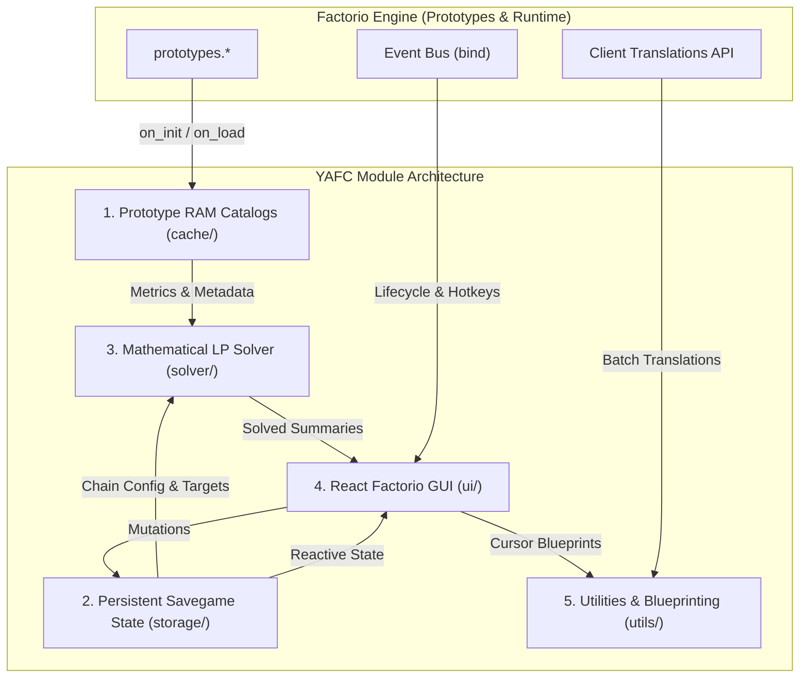
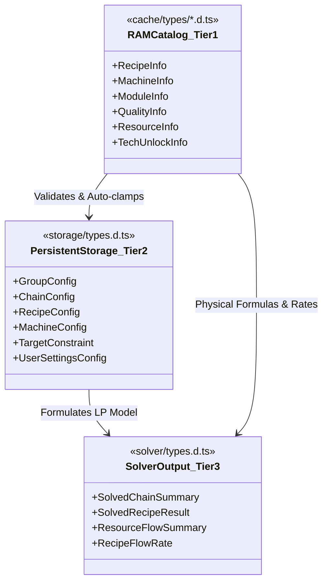
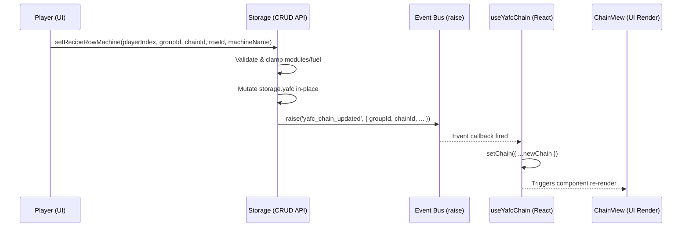
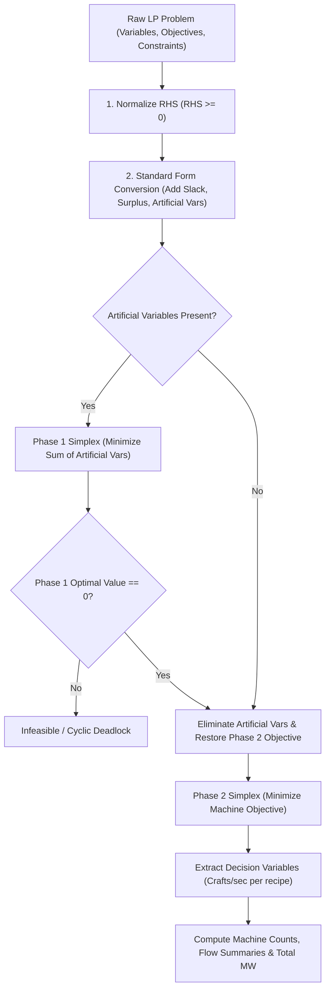

# YAFC Module (Yet Another Factorio Calculator) — Complete Architecture & Developer Guide

This document defines the complete technical architecture, data structures, GUI lifecycle, cache models, mathematical LP solver pipeline, and Factorio 2.0 (Space Age) integration patterns for the **YAFC** module in `qol_by_morality`.

---

## 1. Overview & Architectural Principles

YAFC is an in-game high-performance production planner and linear programming calculator designed for Factorio 2.0 and Space Age. It allows players to construct hierarchical production chains, optimize machine and module configurations, resolve closed recycling and Kovarex loops, compute exact power/fuel demands, and export blueprints directly to the cursor.



### Core Design Tenets:
1. **Strict Stage & Memory Separation:**
   - **Persistent Storage (`storage.yafc`):** Holds minimal, JSON-serializable state (numeric IDs, string prototype identifiers, module counts, target rate numbers, custom constraints). Never stores native Factorio Lua objects (`LuaEntity`, `LuaPlayer`), functions, or transient pointers.
   - **RAM Prototype Catalogs (`cache/`):** Precomputed during `on_init` and `on_load`. Holds normalized data models, pre-sorted arrays, and $O(1)$ reverse lookup indexes (`byProduct`, `byIngredient`).
   - **Solver Result Models (`solver/`):** Ephemeral calculation summaries generated on-demand and memoized by React components.
2. **Zero-Baggage RAM Optimization:**
   - Prototype `order` strings are processed and compared once during catalog construction.
   - Searching avoids runtime `string.lower()` allocations by caching pre-lowercased prototype identifiers and translated names.
3. **Pure Functional Store Architecture:**
   - All state mutations are performed through pure functional helper functions in `Storage.*` (no stateful classes).
   - Mutations trigger fine-grained custom events (`yafc_groups_changed`, `yafc_chains_changed`, `yafc_chain_updated`) via `fcore/utils/event`, driving immediate UI updates without tick polling.
4. **Discriminative Physical Typings:**
   - Physical Factorio machines and recipes are typed via strict TypeScript discriminated unions (`CraftingMachineInfo`, `MiningDrillInfo`, `BoilerInfo`, `GeneratorInfo`, `ReactorInfo`, `FusionReactorInfo`, `ThrusterInfo`, `BeaconInfo`).
   - Clear distinction between standard crafting recipes and virtual thermodynamic processes.
5. **Two-Phase Dense Simplex Solver:**
   - Handles multi-product recipes, byproducts, surplus absorption, ground resource extraction, thermodynamic conversions, and cyclic loops (Kovarex, scrap recycling) without numeric divergence.

---

## 2. Directory Structure

```
src/modules/yafc/
├── AGENTS.md                  # Complete architectural instruction and developer guide
├── constants.ts               # Component names, virtual recipe IDs, UI constants, captions
├── data.ts                    # Prototype-stage definitions (sprites, shortcuts, custom inputs)
├── settings.ts                # Mod startup settings (qol-enable-yafc)
├── index.ts                   # Module lifecycle, top-level React root registration, hotkeys
│
├── cache/                     # Precomputed RAM prototype catalogs & indexing
│   ├── index.ts               # Catalog lifecycle (init, buildAllPrototypeCaches) & public API
│   ├── common.ts              # Prototype order comparison with alphabetical tie-breaking
│   ├── quality.ts             # Quality catalog, QualityScaled<T> metric compression
│   ├── technologies.ts        # Technology unlock mapping & science pack progression tiers
│   ├── resources.ts           # Item, fluid, heat, and electricity catalogs & fluid temps
│   ├── modules.ts             # Installable module catalog & effect calculation
│   ├── entities.ts            # Machine, drill, boiler, reactor, and beacon catalogs
│   ├── recipes.ts             # Standard & virtual recipes, reverse product/ingredient indexes
│   └── types/                 # TypeScript type definitions for RAM cache
│       ├── common.d.ts        # QualityScaled<T>, BaseInfo
│       ├── entities.d.ts      # MachineInfo, BeaconInfo, FluidBoxInfo, EnergySourceInfo
│       ├── modules.d.ts       # ModuleInfo, ModuleEffects
│       ├── quality.d.ts       # QualityInfo
│       ├── recipes.d.ts       # RecipeInfo, RecipeIngredient, RecipeProduct, RecipeFilter
│       ├── resources.d.ts     # ItemInfo, FluidInfo, HeatInfo, ElectricityInfo, ResourceFilter
│       └── technologies.d.ts  # TechUnlockInfo
│
├── storage/                   # Persistent savegame state & reactive store API
│   ├── index.ts               # Public facade (barrel re-export)
│   ├── events.ts              # Storage initialization & reactive Factorio custom events
│   ├── playerState.ts         # Per-player active tabs & user layout settings
│   ├── groups.ts              # Production group CRUD & ordering
│   ├── chains.ts              # Production chain CRUD, target constraints, icon sync
│   ├── recipes.ts             # Recipe CRUD, machine/module/beacon/fuel configuration
│   ├── hooks.ts               # Reactive React subscription hooks (useYafcGroups, useYafcChain)
│   ├── validation.ts          # Prototype validation & module/beacon capacity clamping
│   └── types.d.ts             # Global Yafc namespace (GroupConfig, ChainConfig, RecipeConfig)
│
├── solver/                    # Linear programming solver & physical calculations
│   ├── RecipeCalculations.ts  # Machine physics, speed/prod/consumption bonuses, fuel rates
│   ├── ModelBuilder.ts        # LP matrix construction, target flow equations, bounds
│   ├── Simplex.ts             # Two-Phase Dense Simplex solver implementation
│   └── types.d.ts             # SolvedChainSummary, SolvedRecipeResult, ResourceFlowSummary
│
├── ui/                        # Factorio React GUI components
│   ├── YafcWindow.tsx         # Main calculator window with useWindow integration
│   ├── YafcPinWindow.tsx      # Lightweight HUD pinned overlay for player screen
│   ├── BarGroup.tsx           # Multi-line production group tabs with Drag-and-Drop
│   ├── BarChain.tsx           # Production chain tabs with icon previews & Drag-and-Drop
│   ├── ChainView.tsx          # Production table & summary panel (Desired, Inputs, Outputs)
│   ├── SettingsView.tsx       # User layout customizer (window ratio, table column ordering)
│   ├── SlotView.tsx           # Universal slot button (badges for quality, unlocks, badges)
│   ├── ResourceRateSlot.tsx   # 60x40 resource slot with temperature labels & flow rate text
│   ├── QualityList.tsx        # Interactive quality tier picker widget
│   ├── ModalRecipePicker.tsx  # Modal recipe selector
│   ├── ModalResourcePicker.tsx# Modal item/fluid/heat/electricity selector
│   ├── ModalMachineSelector.tsx# Modal machine prototype & quality selector
│   ├── ModalModuleSelector.tsx # Modal module slot configuration dialog
│   ├── ModalBeaconSelector.tsx # Modal beacon count & module configuration dialog
│   ├── ModalFuelSelector.tsx   # Modal burner fuel picker dialog
│   └── ModalGroupSettings.tsx # Modal group name, icon & public/private visibility dialog
│
├── utils/                     # Helper modules
│   ├── blueprint.ts           # Dynamic blueprint string / cursor item generation
│   ├── Translator.ts          # Factorio 2.0 batch string translation & zero-alloc search
│   ├── format.ts              # Power (kW/MW/GW) and flow rate string formatters
│   └── physics.ts             # Fluid heating, generator power, burner fuel math
│
└── locale/                    # Localization definitions
    ├── en/yafc.cfg            # English translations
    └── ru/yafc.cfg            # Russian translations
```

---

## 3. Three-Tier Data Architecture

YAFC strictly separates data into three distinct architectural tiers:



### Layer Comparison Matrix:

| Metric / Aspect | Tier 1: RAM Catalogs (`cache/`) | Tier 2: Savegame Storage (`storage/`) | Tier 3: Solver Outputs (`solver/`) |
| :--- | :--- | :--- | :--- |
| **Location** | Lua VM RAM module tables | `storage.yafc` table | Ephemeral RAM (React `useMemo`) |
| **Lifecycle** | Rebuilt on `on_init` & `on_load` | Persisted across saves & syncs | Calculated on chain update |
| **Data Types** | Rich objects, callbacks, functions | Plain objects, numbers, strings | Derived numeric metrics & flows |
| **Key Types** | `RecipeInfo`, `MachineInfo`, `ResourceInfo` | `GroupConfig`, `ChainConfig`, `RecipeConfig` | `SolvedChainSummary`, `SolvedRecipeResult` |
| **Factorio C++ Ref** | Safe (via prototypes metadata) | **STRICTLY PROHIBITED** | Safe (derived display records) |

---

## 4. Prototype RAM Cache Architecture (`cache/`)

### 1. Cache Initialization Lifecycle:
On game start (`on_init`) or savegame load (`on_load`), `init()` builds all normalized catalogs synchronously:

```typescript
export function init(): void {
  buildTechUnlockMap();       // 1. Map recipes to unlocking technologies & science tiers
  buildQualityCatalog();      // 2. Index Factorio 2.0 quality levels & bonuses
  buildModuleCatalog();       // 3. Index installable modules & quality-scaled effects
  buildResourceCatalog();     // 4. Index physical items, fluids, and virtual flows
  buildEntityCatalog();       // 5. Index crafting machines, drills, boilers, beacons
  buildRecipeCatalog();       // 6. Index standard & virtual thermodynamic recipes
  finalizeResourceCatalog();  // 7. Sort resources & sync tech unlocks
  finalizeRecipeCatalog();    // 8. Sync virtual recipe technology unlocks

  // Free temporary build-time indexing data from Lua VM RAM
  clearTechnologyBuildData();
  clearModuleBuildData();
  clearEntityBuildData();
  clearResourceBuildData();
}
```

### 2. Quality Metric Compression (`QualityScaled<T>`):
To avoid allocating redundant Lua tables when entity properties (e.g. module inventory size, energy usage) are identical across all quality tiers, `buildQualityMetric()` compresses uniform values into a single primitive:

```typescript
export function resolveQualityValue<T>(
  metric: QualityScaled<T> | undefined,
  quality: string = DEFAULT_QUALITY_ID,
): T {
  if (typeof metric === 'object' && metric !== null) {
    const record = metric as Record<string, T>;
    if (record[quality] !== undefined) return record[quality];
  }
  return metric as T;
}
```

### 3. Virtual Recipes for Physical Processes:
Standard crafting recipes in Factorio are defined in `prototypes.recipe`. However, power generation, fluid pumping, boiling, ground mining, and nuclear reactions do not have standard recipes. YAFC generates virtual `RecipeInfo` instances for these processes:

| Process Type | Virtual Recipe Prefix | Machine Type | Inputs | Outputs |
| :--- | :--- | :--- | :--- | :--- |
| **Ground Mining** | `yafc-mining-<name>` | `mining-drill` | Mining fluid (optional) | Mined item/fluid |
| **Offshore Pumping** | `yafc-pump-<fluid>` | `offshore-pump` | None | Fluid (default temp) |
| **Boiler / Exchanger** | `yafc-boiler-<machine>-<T>C` | `boiler` | Input fluid + Fuel/Heat | Output heated fluid |
| **Steam Generator** | `yafc-generator-<machine>-<T>C`| `generator` | Heated fluid | Electricity + Spent fluid |
| **Burner Generator** | `yafc-burner-generator-<name>` | `burner-generator`| Burner fuel | Electricity |
| **Nuclear Reactor** | `yafc-reactor-<name>` | `reactor` | Burner fuel (uranium) | Heat |
| **Fusion Reactor** | `yafc-reactor-<name>` | `fusion-reactor` | Plasma fluid + Electricity | Superheated plasma |
| **Fusion Generator** | `yafc-generator-<name>` | `fusion-generator`| Superheated plasma | Electricity + Spent plasma |
| **Rocket Thruster** | `yafc-thruster-<name>` | `thruster` | Fuel fluid + Oxidizer | Thrust (void) |

### 4. Discrete Fluid Temperature Indexing:
Fluids in Factorio 2.0 have temperatures (e.g. steam at 165°C vs 500°C). YAFC indexes discrete fluid variants dynamically:
- `fluidsByTemperature["steam@165"]` $\to$ `FluidInfo` (singleton instance for 165°C steam).
- When a new temperature variant is discovered (e.g. via recipe ingredient or boiler output), `onFluidRegistered` dynamically creates and registers compatible boiler and generator recipes.

### 5. $O(1)$ Reverse Lookup Indexes:
- `recipesByProductItem`: `Record<string, RecipeInfo[]>` — recipes producing a specific item.
- `recipesByProductFluid`: `Record<string, RecipeInfo[]>` — indexed by `name@temperature` and `name@*` (wildcard).
- `recipesByIngredientItem` / `recipesByIngredientFluid` — recipes consuming a specific resource.
- `recipesByProductHeat` / `recipesByProductElectricity` — virtual energy producers.

### 6. Relational Query & Quality Resolution Helpers (`cache/helpers.ts`):
Domain cache modules (`entities.ts`, `recipes.ts`, `resources.ts`, `modules.ts`, `quality.ts`) strictly hold internal in-memory tables and build/finalize logic. All relational cross-domain queries and quality resolution utilities reside in `cache/helpers.ts` (re-exported via `cache/index.ts`):
- `resolveEntityQuality(entity, chosenQuality)`: Resolves fixed-quality machine or beacon prototypes vs user selection (returns canonical `QualityInfo`).
- `resolveRecipeQuality(recipe, chosenQuality)`: Verifies if recipe allows setting quality or enforces standard (returns canonical `QualityInfo`).
- `resolveResourceQuality(resource, chosenQuality)`: Checks whether resource supports quality (items vs fluids/energy; returns canonical `QualityInfo`).
- `getEntityMaxModuleSlots(entity, quality)`: Resolves total module inventory capacity for a machine or beacon across qualities (`quality?: QualityInfo`).
- `getValidModulesForEntityAndRecipe(entity, recipe)`: Filters compatible module items based on receiver and recipe restrictions.
- `isModuleAllowedForRecipe(machine, recipe, quality)`: Checks if a machine can accept internal modules for a recipe.
- `isBeaconAllowedForRecipe(machine, recipe)`: Checks if a machine can receive beacon transmissions for a recipe.
- `getDefaultMachineForRecipe(recipe, force)`: Resolves the highest unlocked compatible crafting machine.
- `isFuelValidForMachine(machine, fuel)`: Validates burner fuel category compatibility against machine energy source.
- `getDefaultFuelForMachine(machine, force)`: Resolves the highest unlocked compatible fuel resource.
- `isResourceValidForRecipe(recipe, resourceName, options)`: Verifies if a resource participates as an input ingredient or output product.

---

## 5. Storage Schema & Reactive Store (`storage/`)

### 1. Global Persistent Schema (`storage.yafc`):
```typescript
declare namespace Yafc {
  interface StorageSchema {
    groups: Record<number, GroupConfig | undefined>;
    groupIds: number[];
    playerState: Record<PlayerIndex, PlayerState>;
    nextGroupId: number;
  }

  interface GroupConfig {
    id: number;
    name: string;
    icon?: string;
    isPublic: boolean;
    ownerPlayerIndex: PlayerIndex;
    nextChainId?: number;
    chainIds: number[];
    chains: Record<number, ChainConfig | undefined>;
  }

  interface ChainConfig {
    id: number;
    icon?: string;
    recipes: Record<number, RecipeConfig | undefined>;
    recipeIds: number[];
    targets: TargetConstraint[];
    isValid?: boolean;
    nextRowId?: number;
  }

  interface RecipeConfig {
    id: number;
    version: number;
    recipeName: string;
    recipeQuality?: string;
    machine: MachineConfig;
    fixedConstraint?: FixedRecipeConstraint;
  }
}
```

### 2. Reactive Event Bus:
Mutations in `Storage.*` trigger events via `raise(...)`:
- `EVENTS.GROUPS_CHANGED` (`'yafc_groups_changed'`): `YafcGroupsChangedPayload` (`{ isPublic: boolean; playerIndex?: PlayerIndex }`)
- `EVENTS.CHAINS_CHANGED` (`'yafc_chains_changed'`): `YafcChainsChangedPayload` (`{ groupId: number; isPublic: boolean; playerIndex?: PlayerIndex }`)
- `EVENTS.CHAIN_UPDATED` (`'yafc_chain_updated'`): `YafcChainUpdatedPayload` (`{ groupId: number; chainId: number; isPublic: boolean; playerIndex?: PlayerIndex }`)



### 3. Custom React Hooks:
- `useYafcGroups(playerIndex)`: Subscribes to group additions, removals, reorders, and visibility changes.
- `useYafcChains(playerIndex, groupId)`: Subscribes to chain additions and deletions in the active group.
- `useYafcChain(playerIndex, groupId, chainId)`: Subscribes to row modifications, machine changes, module adjustments, and target rate updates.

### 4. Validation & Auto-Clamping Helpers:
- `validateAndClampModules(machine, modules, quality, recipe)`: Clamps module counts to the machine's maximum slots and filters out incompatible modules (e.g. productivity modules on non-intermediate recipes).
- `validateAndClampBeacons(beaconConfigs)`: Validates beacon modules and distribution profiles.
- `isFuelValidForMachine(machine, fuel)`: Validates fuel category compatibility for burner energy sources.
- `validateAllChains()`: Runs on `on_configuration_changed` to mark chains with missing mod items as `isValid = false` without crashing or corrupting user configurations.

---

## 6. Mathematical LP Solver (`solver/`)

### 1. Physical Calculations (`RecipeCalculations.ts`):

1. **Effective Crafting Speed:**
   $$\text{Speed} = \text{baseSpeed}(\text{quality}) \times \max(0.2, 1.0 + \text{speedBonus})$$
   $$\text{CraftTime} = \frac{\text{recipeEnergy}}{\text{Speed}}$$
   $$\text{CraftsPerSecPerMachine} = \frac{1.0}{\text{CraftTime}}$$

2. **Productivity Multiplier:**
   $$\text{ProdMultiplier} = 1.0 + \max(0, \text{baseProd} + \text{moduleProd} + \text{forceMiningProd})$$
   *(Note: Products marked `ignoredByProductivity: true` use a fixed $1.0\times$ multiplier).*

3. **Space Age 2.0 Probabilistic Quality Roll:**
   When quality modules are installed ($\text{qualityBonus} > 0$), product outputs are split probabilistically across higher quality tiers using `nextProbability` and `chainProbability`.

4. **Power & Fuel Consumption:**
   $$\text{PowerWatts} = (\text{maxEnergyUsageJPerTick} \times 60) \times \max(0.2, 1.0 + \text{consumptionBonus})$$
   $$\text{FuelPerCraft} = \frac{\text{PowerWatts} \times \text{CraftTime}}{\text{fuelValueJoules} \times \text{burnerEffectivity}}$$

---

### 2. Linear Programming Formulation (`ModelBuilder.ts`):

The production chain is formulated as a standard Linear Programming problem:

- **Variables:** $x_0, x_1, \dots, x_{n-1} \ge 0$, where $x_i$ is the number of craft executions per second for recipe row $i$.
- **Objective Function:** Minimize total required machines:
  $$\min \sum_{i=0}^{n-1} \left( \frac{1}{\text{CraftsPerSecPerMachine}_i} \right) x_i$$
- **Flow Balance Constraints:** For each unique good $g$ (resource + quality):
  $$\sum_{i=0}^{n-1} \text{ProductYield}_{i,g} \cdot x_i - \sum_{i=0}^{n-1} \text{IngredientDemand}_{i,g} \cdot x_i = \text{TargetRate}_g$$
  - Pure output targets: $\ge \text{TargetRate}_g$ (allows surplus).
  - Pure input targets: $\ge \text{TargetRate}_g$ (constrains consumption).
  - Unconstrained internal intermediates: $\ge 0$ (allows surplus to solve closed recycling and Kovarex loops without deadlocks).
- **Pinned Building Constraints:** For recipes with user-pinned machine counts $B_i$:
  $$x_i = B_i \times \text{CraftsPerSecPerMachine}_i$$

---

### 3. Two-Phase Dense Simplex Algorithm (`Simplex.ts`):



- **Phase 1:** Solves an auxiliary problem minimizing the sum of artificial variables. If the optimal objective $> 10^{-4}$, the recipe network is infeasible (e.g. unresolvable demand or mutually exclusive constraints).
- **Phase 2:** Optimizes the primary objective (machine minimization) using Dantzig's Pivot Rule and the Minimum Ratio Test with $\epsilon = 10^{-7}$ tolerance.

---

## 7. UI & Factorio React Architecture (`ui/`)

### 1. Window Management & Input Lifecycle (`useWindow`):
- `YafcWindow` and modal pickers use the `useWindow(playerIndex, options)` hook from `fcore/react`.
- Integrates with native Factorio GUI close hotkeys (ESC, 'E', or opening another full-screen GUI).
- Calculates dimensions dynamically using `player.display_resolution` and `player.display_scale`.

### 2. Factorio 2.0 Hydration Safety Rule:
> [!IMPORTANT]
> In Factorio, `game` is strictly `nil` during `script.on_load`. Because React executes component render passes during `on_load` hydration to restore transient RAM fibers and event handlers, top-level component render functions must NEVER assume `game` is defined.
> Always access `player` via safe guards:
> ```typescript
> const player = typeof game !== 'undefined' && game ? game.get_player(playerIndex) : undefined;
> const res = player?.display_resolution || { width: 1920, height: 1080 };
> ```

### 3. Drag-and-Drop Tab Reordering (`useDragReorder`):
`BarGroup.tsx` and `BarChain.tsx` use the `useDragReorder` hook from `fcore/react` for intuitive drag-and-drop tab reordering:
- Left-click tab: selects group/chain.
- Drag tab: displays green ghost preview (`react_tab_button_yellow_no_padding` / `react_slot_button_green`).
- Drop tab: commits reordered array to `Storage.reorderGroupsByList` or `Storage.reorderChainsByList`.
- Right-click group tab: opens `ModalGroupSettings` to edit name, icon, and public visibility.

### 4. Production Table Column Ordering:
The production table in `ChainView.tsx` dynamically renders columns based on `settings.columnOrder`:
- `'index'`: Row sequence number.
- `'recipe'`: Recipe icon, localized title, and craft speed.
- `'machine'`: Machine icon, quality badge, building count (`x4.25`), and pin button.
- `'energy'`: Electrical consumption (kW/MW) or fuel slot with fuel selection modal.
- `'modules'`: Installed machine modules with fill shortcuts.
- `'beacons'`: Beacon configuration and module multipliers.
- `'products'`: Output flow rate badges ($+15.0/\text{s}$).
- `'ingredients'`: Input flow rate badges ($-30.0/\text{s}$), clicking opens `ModalRecipePicker` filtered to recipes producing this ingredient.
- `'actions'`: Reorder buttons (Move Up/Down), pin building count, and delete row with `ConfirmDelete` popup.

---

## 8. Utilities & Helpers (`utils/`)

### 1. `blueprint.ts`:
Constructs Factorio blueprint objects directly in the player's cursor stack:
- Sets entity name, position, recipe, and quality tier.
- Maps module configurations to `BlueprintInsertPlan` targeting `defines.inventory.crafter_modules` or `defines.inventory.beacon_modules`.

### 2. `Translator.ts`:
- Uses Factorio 2.0 `player.request_translations(localised_strings)` to translate recipe, item, fluid, and entity names into the client's language.
- Stores pre-lowercased translations in `playerSearchTranslations` to achieve $O(1)$ zero-allocation search filtering in `ModalResourcePicker`.

### 3. `physics.ts`:
- `getFluidHeatingEnergyPerUnit(heatCapacity, inTemp, targetTemp)`: Computes thermal energy in Joules.
- `calculateBoilerFluidFlow(powerJoules, heatCapacity, inTemp, targetTemp)`: Computes boiler fluid throughput.
- `calculateGeneratorPower(fluidFlow, heatCapacity, defaultTemp, inTemp, maxMachineTemp)`: Computes electrical power output.
- `calculateBurnerFuelConsumption(energyJoules, fuelValueJoules, effectivity)`: Computes fuel consumption.

---

## 9. TSTL & Factorio Lua VM Best Practices

| Task / Feature | ❌ Anti-pattern | ✅ Correct Pattern | Rationale |
| :--- | :--- | :--- | :--- |
| **Delete Table Key** | `delete obj[key]` | `obj[key] = undefined` | `obj[key] = undefined` compiles to native Lua opcode `obj[key] = nil` without `__TS__Delete` polyfill. |
| **Array Iteration** | `for (let i = 0; i < arr.length; i++)` | `for (const item of arr)` | `for..of` compiles directly to native Lua `ipairs()`. |
| **Dictionary Iteration** | `Object.entries(dict)` | `for (const [k, v] of pairs(dict))` | `pairs()` iterates Lua hash tables directly with 0 memory allocation. |
| **Collections** | `new Map()`, `new Set()` | `Record<K, V>` or `LuaTable<K, V>` | Compiles to native Lua tables `{}` ($O(1)$ operations). |
| **Multiple Returns** | `return { a, b }` or `return [a, b]` | `return $multi(a, b)` | `LuaMultiReturn` compiles to native Lua multi-return (`return a, b`) via VM stack registers (0 heap allocation). |
| **Type Imports** | `import('...').Type` inline | `import type { Type } from '...'` | Top-level imports preserve clean module boundaries and satisfy linter rules. |
| **Event Registration** | `script.on_init(...)` | `bind('on_init', ...)` | Centralized event bus prevents handler overwriting and supports multiple subscribers. |

---

## 10. Summary & Verification

When extending or modifying YAFC:
1. Keep persistent state in `storage.yafc` minimal and serializable.
2. Index prototype metadata in RAM catalogs (`cache/`) during `on_init` / `on_load`.
3. Dispatch state mutations through `Storage.*` with `raise(...)` events.
4. Keep the LP solver pure, deterministic, and free of side effects.
5. Verify build integrity via `npm run build` in `C:\Games\mymods\qol`.
